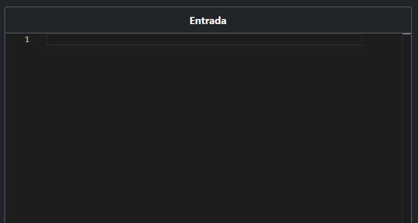
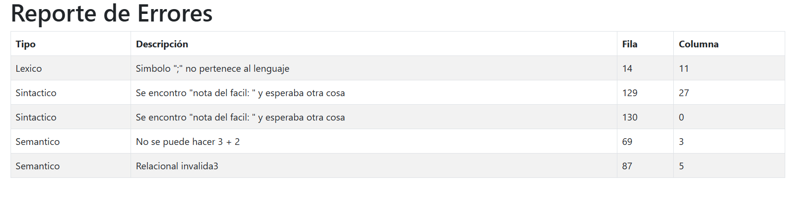
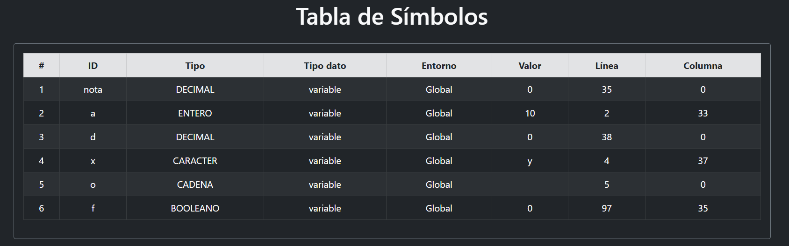
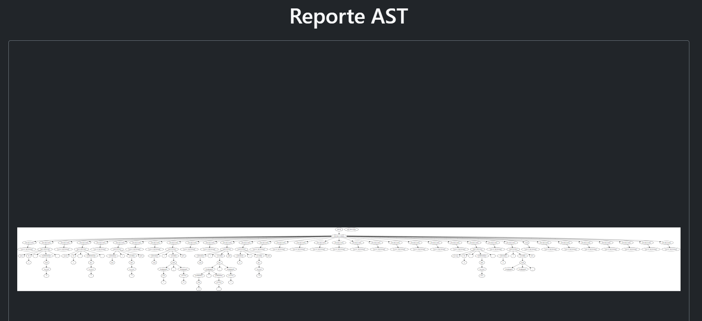
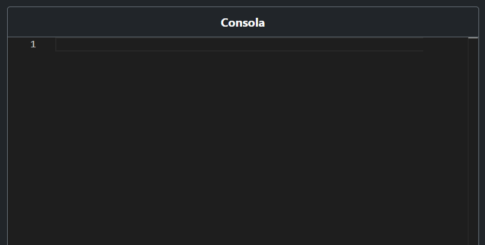

# Manual de Usuario
# SimpliCode


<!DOCTYPE html>
<html lang="es">
<head>
  <meta charset="UTF-8">
  <title>Índice</title>
  <style>
    body {
      font-family: 'Arial', sans-serif;
      background-color: #f4f4f4;
      margin: 0;
      padding: 20px;
    }
    .index {
      background-color: #fff;
      padding: 20px;
      border-radius: 8px;
      box-shadow: 0 4px 6px rgba(0,0,0,0.1);
      max-width: 600px;
      margin: auto;
    }
    .index h1 {
      text-align: center;
      color: #333;
      margin-bottom: 20px;
    }
    .index ul {
      list-style: none;
      padding: 0;
    }
    .index li {
      padding: 12px;
      border-bottom: 1px solid #ddd;
      display: flex;
      align-items: center;
      transition: background-color 0.3s;
    }
    .index li:last-child {
      border-bottom: none;
    }
    .index li:hover {
      background-color: #f9f9f9;
    }
    .index li a {
      text-decoration: none;
      color: #333;
      flex-grow: 1;
      font-size: 1.1em;
    }
    .index li i {
      margin-right: 12px;
      color: #007BFF;
    }
  </style>
</head>
<body>
  <div class="index">
    <h1>Índice</h1>
    <ul>
      <li><i class="fas fa-book-open"></i><a href="#introducción">Introducción</a></li>
      <li><i class="fas fa-cogs"></i><a href="#requisitos-del-sistema">Requisitos del Sistema</a></li>
      <li><i class="fas fa-download"></i><a href="#instalacion">Instalación</a></li>
      <li><i class="fas fa-folder-open"></i><a href="#estructura-del-proyecto">Estructura del Proyecto</a></li>
      <li><i class="fas fa-tasks"></i><a href="#funciones-principales">Funciones Principales</a></li>
      <li><i class="fas fa-life-ring"></i><a href="#resolucion-de-problemas">Resolución de Problemas</a></li>
      <li><i class="fas fa-check-circle"></i><a href="#consideraciones-finales">Consideraciones Finales</a></li>
    </ul>
  </div>
  <!-- Recuerda incluir FontAwesome para los iconos -->
  <script src="https://kit.fontawesome.com/a076d05399.js" crossorigin="anonymous"></script>
</body>
</html>

## Introducción
El presente proyecto consiste en la creacion de un lenguaje, capaz de realizar operaciones aritmeticas, estadísticas, además de generar diversos gráficos a partir de una colección de datos.

Este manual tiene como objetivo guiar al usuario en el uso de las funcionalidades del sistema, brindando instrucciones detalladas para su instalación y operación.

## Instalación

1. **Clona el repositorio o descarga el proyecto:**
   ```bash
   git clone https://gitlab.com/ppersonales/olc1_proyecto2_202203009.git
    ```

## Funciones Principales

### 1. Interfaz Principal

Es la interfaz principal del programacion, en la cual se tiene una vista general de lo que compone a este compilador.



### 2. Entrada

En este apartado se puede escribir en el lenguaje que estipula el proyecto.


### 3. Seleccionar archivo

Dicho boton nos ofrece la opcion de cargar un archivo .ci en nuestro de nuestro sistema local.


### 4. Reporte Errores

Dicho boton nos muestra los errores capturados.



### 5. Reporte de Tabla de simbolos

Al pulsar se muestra la tabla de simbolos de la entrada ingresada.



### 6. Reporte AST

Al pulsar la opcion de reporte del arbol, se puede apreciar el AST generado con la entrada proporcionada.



### 7. Interpretar

La opcion de interpretar posee dos opciones, ejecutar y limpiar, al presionar interpretar se ejecuta el analisis lexico y sintactico del programa.


### 8. Consola

En este apartado se muestran los resultados de la ejecucion.




## Resolución de Problemas

- **Error al abrir el archivo de solicitudes:** Asegúrate de que el archivo existe y está en la ubicación correcta.
- **Problemas de compatibilidad al compilar:** Verifica que estás usando el compilador recomendado y que las opciones de jison están habilitadas.

## Consideraciones Finales

Este sistema fue diseñado para gestionar eficientemente la información utilizando estructuras de datos dinámicas. A medida que el sistema crezca, considera optimizar las operaciones de búsqueda y gestión de datos. Además, asegúrate de realizar pruebas regulares para mantener la estabilidad del sistema.

